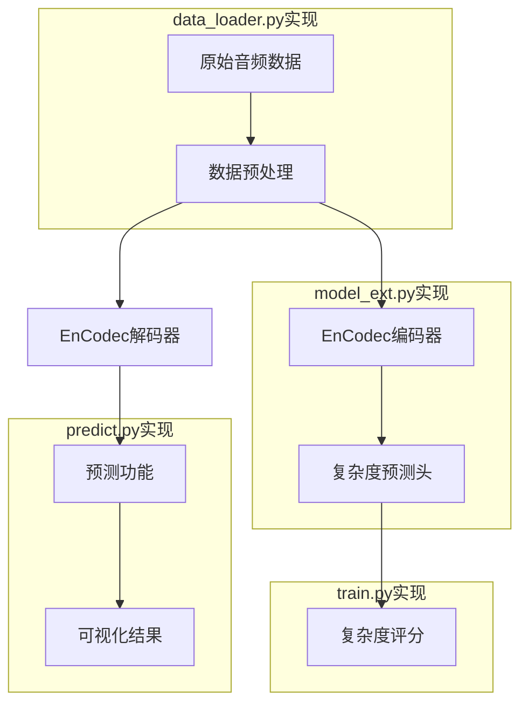

# 中国传统音乐旋律复杂度预测系统

基于EnCodec模型的微调实现，用于预测中国传统变奏曲旋律片段的相对复杂度。

## 项目背景

本项目使用I-information content(IC)计算方法，通过对EnCodec模型的微调，实现对传统中国音乐旋律片段复杂度的预测。主要使用`dataset/verified_mp3`中的音频数据和对应的复杂度标签进行训练。

## 技术架构



### 各层功能说明

1. **数据层** (data_loader.py)
   - 音频文件加载和预处理
   - 标签数据匹配
   - 数据集划分

2. **模型层** (model_ext.py) 
   - 预训练模型加载
   - 复杂度预测头实现
   - 前向传播逻辑

3. **训练层** (train.py)
   - 训练循环实现
   - 评估指标计算
   - 模型保存

4. **应用层** (predict.py)
   - 模型加载和推理
   - 复杂度预测
   - 结果可视化

## 项目结构

```
fine_tune/
├── __init__.py         # 模块初始化
├── data_loader.py      # 音频数据加载和处理
├── model_ext.py        # 扩展的EnCodec模型
├── train.py            # 训练脚本
├── predict.py          # 预测脚本
├── requirements.txt    # 依赖项
└── README.md           # 项目文档
```

## 数据流与输出说明

### 模型输出特性
1. 输出类型：连续值(浮点数)
2. 输出范围：与训练标签中的complexity分数范围一致
3. 与标签对应：直接预测labels.csv中的complexity字段值
4. 输出解释：数值越大表示旋律复杂度越高

### 数据处理流程
   - 从`labels.csv`读取已验证的音频文件信息
   - 加载对应的MP3音频文件
   - 根据boundary字段分割音频片段
   - 将complexity字段作为标签

2. **训练阶段**：
   - 加载预训练EnCodec模型
   - 冻结编码器参数
   - 添加复杂度预测头
   - 使用MSE损失函数进行训练

3. **预测阶段**：
   - 加载训练好的模型
   - 预处理输入音频
   - 预测复杂度分数
   - 可视化结果

## 微调方案详解

### 1. 模型修改

在`model_ext.py`中实现：
```python
class EncodecComplexityModel(nn.Module):
    def __init__(self):
        # 加载预训练EnCodec
        self.encodec = EncodecModel.encodec_model_24khz()
        
        # 冻结编码器参数
        for param in self.encodec.parameters():
            param.requires_grad = False
            
        # 添加复杂度预测头
        # 输入: EnCodec编码器输出的128维特征
        # 输出: 1维复杂度分数
        self.complexity_head = nn.Sequential(
            nn.Linear(128, 256),  # 第一全连接层，扩展特征维度
            nn.ReLU(),           # 非线性激活
            nn.Dropout(0.3),     # 防止过拟合
            nn.Linear(256, 256), # 第二全连接层
            nn.ReLU(),
            nn.Linear(256, 1)    # 最终输出层
        )
        # 设计考虑:
        # 1. 逐步降维避免信息损失
        # 2. ReLU激活引入非线性
        # 3. Dropout层增强泛化能力
        # 4. 最终输出为连续值(无激活函数)，直接对应标签中的complexity分数
        # 5. 输出范围与训练标签范围一致(需根据labels.csv中的complexity范围确定)
```

### 2. 训练流程

1. 数据预处理：
   - 音频重采样到24kHz
   - 根据boundary分割片段
   - 归一化处理

2. 训练配置：
   - 优化器：Adam (lr=1e-4)
   - 损失函数：MSE
   - 评估指标：MAE, R2
   - 学习率调度：ReduceLROnPlateau

3. 训练命令：
```bash
python -m fine_tune.train \
  --batch_size 8 \
  --epochs 50 \
  --lr 1e-4 \
  --device cuda
```

### 3. 预测流程

1. 加载模型：
```python
model = load_model("checkpoints/best_model.pth")
```

2. 预测复杂度：
```python
complexity = predict_audio_complexity(model, "audio.mp3")
```

3. 可视化结果：
```python
plot_complexity("audio.mp3", complexity, "output.png")
```

## 使用指南

### 本地训练
```bash
python -m fine_tune.train \
  --batch_size 8 \
  --epochs 50 \
  --lr 1e-4 \
  --device cuda \
  --save_dir checkpoints
```

### 远程GPU服务器训练指南

1. **连接服务器**
```bash
ssh fd-lamt-04@10.177.64.182
# 输入密码后登录
```

2. **环境配置**
```bash
# 1. 安装Miniconda
wget https://repo.anaconda.com/miniconda/Miniconda3-latest-Linux-x86_64.sh
bash Miniconda3-latest-Linux-x86_64.sh

# 2. 创建环境
conda create -n encodec python=3.9
conda activate encodec

# 3. 安装依赖
pip install -r requirements.txt
```

3. **传输代码**
```bash
# 从本地传输代码到服务器
scp -r fine_tune fd-lamt-04@10.177.64.182:~/lamt/
```

4. **启动训练**
```bash
cd ~/lamt
conda activate encodec
python -m fine_tune.train \
  --batch_size 16 \  # 可增大batch size利用GPU显存
  --epochs 50 \
  --lr 1e-4 \
  --device cuda \
  --save_dir checkpoints
```

5. **获取训练结果**
```bash
# 将模型从服务器下载到本地
scp fd-lamt-04@10.177.64.182:~/lamt/checkpoints/best_model.pth ./
```

### 注意事项
1. 使用tmux或screen保持会话
2. 监控GPU使用情况：`nvidia-smi -l 1`
3. 调整batch_size充分利用GPU显存

### 预测复杂度
```bash
python -m fine_tune.predict sample.mp3 \
  --model_path checkpoints/best_model.pth \
  --save_plot result.png
```
